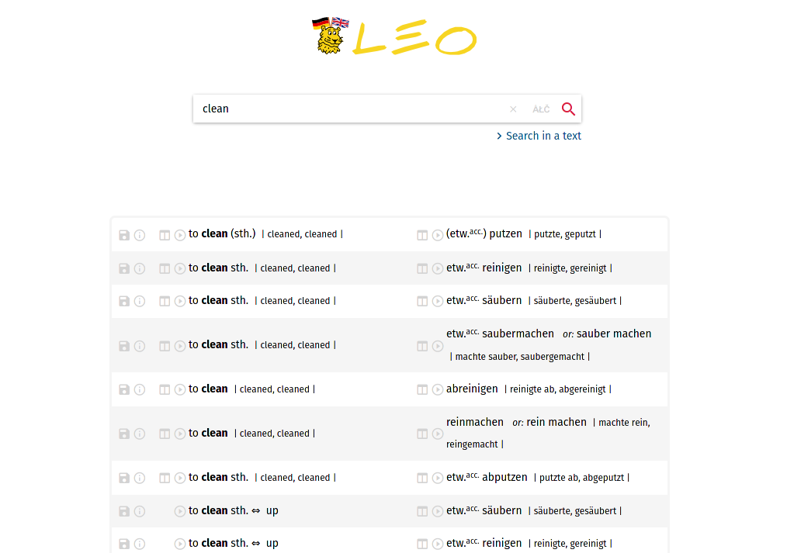

# Clean leo.org

A clean userstyle for [dict.leo.org](https://dict.leo.org).

**Note:** A lot of leo.org's functionality is not accessible. This style is intended to throw away everything apart from the actual results.

## Preview

## Installation

Userstyles can be managed using the [Stylus](https://add0n.com/stylus.html) extension for Firefox, Chrome and Opera, which is the more user-friendly and privacy-oriented successor to Stylish.

## Known Issues
- Table heads (e.g. "Nouns", "Verbs") are missing
- A loading bar sometimes appears in the top left corner
